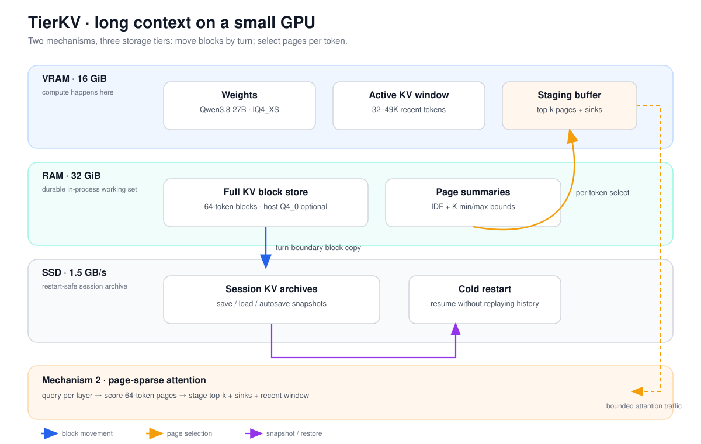

# TierKV

<p align="center">
  
</p>

<p align="center"><strong>Keep the context. Keep the GPU small.</strong></p>

**An independent fork of [llama.cpp](https://github.com/ggml-org/llama.cpp) for running end-to-end
coding-agent tasks on consumer GPUs with limited VRAM.**

Upstream base: `ggml-org/llama.cpp` @ `c77ae69` (2026-09-17). This is not a pull request to
upstream — it is a research fork. Everything TierKV adds is opt-in via environment variables,
so the stock llama.cpp behavior is unchanged unless enabled.

The reference machine is a single **RTX 5060 Ti 16 GB** (16,311 MiB) with 32 GB of system RAM
and a 3.5 GB/s NVMe, running **Qwen3.8-27B** (IQ4_XS, ~13.2 GiB) as the coding agent.

---

## 1. The problem, in plain words

A 27B model at 4-bit already fills most of a 16 GB card. On top of that, every conversation
needs a **KV cache** — the model's running memory of what has been said. It grows with the
conversation:

| Conversation length | KV cache (Q4_0) | Fits next to the weights? |
| ---: | ---: | --- |
| 8K tokens | 0.15 GB | yes |
| 57K tokens | 1.0 GB | barely (that is the dense ceiling we measured) |
| 262K tokens | 4.7 GB | no |

Agent tasks are exactly the ones that blow this up: the agent reads files, writes code, runs
tests, reads the failures, tries again — a single session easily reaches 50-260K tokens.
The usual answers are bad:

- **Drop old context** → the agent forgets the task and starts looping.
- **Stream the whole cache from RAM every token** (page-in/page-out per layer) → decode
  collapses to single-digit tok/s, because a 256K cache is ~5 GB per generated token.
- **Buy a bigger GPU** → not the point.

## 2. The idea: a desk, a bookshelf, and an archive

TierKV treats the KV cache like a workspace librarian treats paper:

- **VRAM = the desk.** Only what is needed *right now*: the model weights, a bounded window of
  recent conversation (32-49K tokens), and a handful of "recalled" older pages. Compute always
  happens on the desk, so the attention cost is bounded no matter how long the conversation is.
- **System RAM = the bookshelf.** As soon as a page of conversation slides off the desk it is
  copied to host RAM — nothing is ever thrown away. At 256K tokens this costs ~4.6 GB.
- **SSD = the archive.** The bookshelf can be written to disk and loaded back, so a restarted
  server resumes a conversation instead of re-reading 200K tokens of history.

The one rule that makes it fast: **pages move at turn boundaries, never per token.** That is
the difference between "flat 22-62 tok/s at any context length" and "8 tok/s at 180K".

Two signals decide which old pages are brought back to the desk:

1. **Word overlap (IDF-weighted).** Cheap, always available, works well when the question
   reuses the vocabulary of the thing it asks about.
2. **Attention scores (page-sparse attention).** Each 64-token page keeps a tiny summary —
   per-channel min/max of its K vectors. The current query (captured from inside the attention
   graph) is scored against every page with the Quest-style upper bound
   `sum_c q_c * max(kmin_c, kmax_c)`; the top pages are staged back into VRAM. This is the
   "page-sparse attention" part: attention effectively runs over a *selected subset* of pages
   plus the recent window, not over the whole history.

### Architecture at a glance

The two mechanisms compose without putting SSD I/O on the decode hot path: the host-tier store
owns complete KV blocks, while the selector decides which summarized pages are gathered into the
bounded device window for the current query.

<p align="center">
  
</p>

The diagram is intentionally literal about the current implementation: the sparse path is a
page gather into ordinary KV cells, not a custom paged-Flash-Attention kernel; SSD snapshots are a
cold-path session mechanism, not a per-token source of KV data.

## 3. What is in this fork

| File | What it does |
| --- | --- |
| `src/llama-kv-pager.{h,cpp}` | The host-tier KV store: save/load rows, IDF + attention selectors, pinning, SSD snapshots |
| `src/llama-kv-cache.{h,cpp}` | Hooks: save-on-evict (`apply_ubatch`, `seq_rm`), room making, staging in `prepare()`, head protection |
| `src/llama-graph.cpp` | Captures the last token's query per layer (`ggml_cpy` into a persistent tensor, CUDA-graph safe) |
| `src/llama-model.cpp` | Decouples the VRAM window from the logical context; exempts MTP contexts from paging |
| `common/speculative.cpp` | MTP draft context size cap (experimental) |
| `scripts-5060ti/` | `start-tierkv-e2e.sh` (full-stack agent config), `start-mtp5.sh` (stage-1 baseline), a decode/prefill probe, and the page-sparse cost prototype |
| `data/` | Raw experiment logs (sweeps, server logs, E2E artifacts) |

### Policy v2 (the parts that made it transparent)

- **Head protection** — the first 2,048 positions (system prompt, task spec) are never evicted.
  Before this, "evict the oldest first" silently deleted the agent's instructions.
- **Eviction-triggered, rate-limited staging** — stage only after new evictions, at most once
  per 1,024 positions. Kills per-step churn; when the conversation fits the window, overhead
  is ~zero.
- **Batched block gather** — whole 64-token blocks are moved with one copy per layer
  (16 copies per block instead of 1,024).
- **Lazy store allocation** — RAM is allocated on first save; unused contexts cost nothing.
- **MTP-context exemption** — speculative-decoding draft contexts are never paged; their KV
  must stay position-aligned with the target.

## 4. Results (measured, RTX 5060 Ti 16 GB)

### Agent E2E — DeliverableBench `ocr-dual-channel`, same agent, same task

| Run | Configuration | Score | Wall time | Decode p50 |
| --- | --- | ---: | ---: | ---: |
| Dense baseline | mainline llama.cpp, MTP-5, window = context 57,344, Q4_0 KV | 100.0 | 433 s | 65.8 tok/s |
| **TierKV full stack** | **window 49,152, Q4_0 KV + host store, hybrid selector, MTP-5** | **100.0** | **398 s** | 62.1 tok/s |
| KVMem reference (separate fork) | 262K logical, 32K retrieved window, MTP-3 | 100.0 | 482 s | 50.3 tok/s |

> KVMem reference project: <https://github.com/kvmem/kvmem-llama.cpp>
> (its scheme is described in the llama.cpp discussion
> <https://github.com/ggml-org/llama.cpp/discussions/28894>).
> Numbers above are from the same machine, task and agent as the TierKV and baseline runs.

The TierKV run completed with 0 human corrections, 72/72 tests green, 40/40 deliverables.

### Long context — single request, no speculation

| Context | Prefill | Decode |
| ---: | ---: | ---: |
| 132K tokens | 713 tok/s | 22.74 tok/s |
| 262K tokens | 680 tok/s | **22.70 tok/s** |

Decode is **flat from 8K to 262K** — the defining property of the design (the desk stays the
same size). Prefill stays compute-bound because it processes only the new tokens.

### Component tests

| Test | Result |
| --- | --- |
| Bit-identical check | pager on (no evictions) vs off: identical greedy output |
| Eviction bookkeeping | 7,769-token prompt through a 2,048-token window: 91,600 KV rows saved, no crash |
| Needle recall (lexical) | needle page ranks #1 (score 3413 vs ~170 for filler); exact recall |
| Needle recall (attention) | needle page ranks #1 (160.3 vs 82.1); exact recall |
| Mixed precision | host Q4_0 / window Q5_0 (576 vs 704 B/row, -18% RAM), recall preserved |
| SSD snapshots | fresh process, loaded 302 MB store, answers a **26-token question** with a passphrase that was never in its own prompt |
| Memory | 4.6 GB host RAM at 256K (Q4_0 store), 15.5 GB VRAM peak |

### Speculative decoding (the other half of the speed)

TierKV leans on the model's built-in MTP head: at 8K context the tuned recipe goes from
**25.7 tok/s** (no speculation) to **56.6** (n_max=3) to **63.7** (n_max=5). Agent traffic
(tool-call JSON) drafts better than prose: 73-80% acceptance, ~5 accepted tokens per
verification pass.

## 5. Quick start

```bash
# build (CUDA >= 13.2.86, cmake >= 3.31 for sm_120a)
cmake -S . -B build -G Ninja -DCMAKE_BUILD_TYPE=Release \
  -DCMAKE_CUDA_ARCHITECTURES=120a-real -DGGML_CUDA=ON -DGGML_CUDA_FA_ALL_QUANTS=ON \
  -DLLAMA_CURL=OFF -DLLAMA_BUILD_TESTS=OFF
cmake --build build -j12 --target llama-server

# run A — TierKV full-stack agent config (the measured E2E: 100.0/100 in 398 s)
#   VRAM window 49,152 | logical ctx 65,536 | Q4_0 KV + host store
#   hybrid selector (IDF + page-sparse attention) | head protection | MTP-5
MODEL=/path/to/Qwen3.8-27B-UD-IQ4_XS-mtp-q4_0.gguf scripts-5060ti/start-tierkv-e2e.sh

# run B — long-context config (256K logical, 32K desk, no speculation)
#   (MTP cannot be windowed; see limitations. Decode is flat ~22.7 tok/s to 262K.)
LLAMA_KV_PAGER=1 LLAMA_KV_PAGER_WINDOW=32768 LLAMA_KV_PAGER_MAX_CTX=262144 \
LLAMA_KV_PAGER_STAGE=1 LLAMA_KV_PAGER_SELECT=hybrid \
build/bin/llama-server -m "$MODEL" -c 262144 --spec-type none -fa on -ctk q4_0 -ctv q4_0 -ngl 99

# stage-1 baseline (no TierKV): plain mainline llama.cpp + MTP-5
MODEL=/path/to/Qwen3.8-27B-UD-IQ4_XS-mtp-q4_0.gguf scripts-5060ti/start-mtp5.sh
```

Key TierKV environment variables (all optional; the fork is stock llama.cpp when unset):

| Variable | Meaning | Default |
| --- | --- | --- |
| `LLAMA_KV_PAGER` | enable the host-tier store | off |
| `LLAMA_KV_PAGER_WINDOW` | VRAM window in tokens (logical `-c` can be larger) | = ctx |
| `LLAMA_KV_PAGER_MAX_CTX` | logical capacity of the store | 262144 |
| `LLAMA_KV_PAGER_STAGE` / `TOPK` / `QUERY` | retrieval staging (IDF + attention) | off / 8 / 64 |
| `LLAMA_KV_PAGER_SELECT` | `lex` (word overlap) / `attn` (page-sparse) / `hybrid` | `lex` |
| `LLAMA_KV_PAGER_HEAD` | protected head positions (system prompt) | 2048 |
| `LLAMA_KV_PAGER_STAGE_EVERY` | min position advance between staging events | 1024 |
| `LLAMA_KV_PAGER_HOST_Q4` | store host rows as Q4_0 even if the window is Q5_0 | off |
| `LLAMA_KV_PAGER_SAVE` / `LOAD` / `AUTOSAVE` | SSD snapshots | off |

## 6. Honest limitations

- **MTP + 256K is not possible on 16 GB with this implementation.** Mainline's MTP draft
  context must cover the target's full position range, and its graph reserve grows with the
  context (~1.1 GiB at 262,144). At 256K the server therefore runs *without* speculation
  (22.7 tok/s). KVMem solved this with a windowed MTP pool plus state replay — porting that
  is the top roadmap item and would put 256K decode in the 70-85 tok/s range.
- **Retrieval coverage.** With a window much smaller than the working set, the model's KV no
  longer matches the token stream the server sends; our selectors do not yet restore enough
  of the agent's own recent history, and agents can lose the thread. Keep the window at or
  above the working set (49K here) until the selector improves.
- **The sparse attention is a gather, not a custom kernel.** Pages are staged into ordinary
  KV cells and standard Flash-Attention runs over them; there is no paged-FA kernel yet.
- The host store preallocates `MAX_CTX` worth of rows (lazily, on first save) — plan RAM
  accordingly (~18.4 KB per token per sequence for Q4_0 K+V across 16 attention layers).
- Benchmarks are single-run and agent wall-times include model-side behavior variance
  (loops); scores are stable, timings are indicative.

## 7. Credits and license

- Built on [llama.cpp](https://github.com/ggml-org/llama.cpp) (MIT) — all upstream code and
  credit belongs to the llama.cpp authors.
- Model: `Qwen3.8-27B-UD-IQ4_XS` (Unsloth), MTP head requantized to Q4_0.
- The comparison point is **KVMem**: <https://github.com/kvmem/kvmem-llama.cpp>; TierKV is an
  independent design (three-tier store + page-sparse selection) that shares the goal of long
  agent contexts on small cards.
- Data and full experiment reports live in the companion repository
  `5060ti-qwen3.8-27b` (`references/kv-paging-design.md`, `references/llama-next-mtp5-data.md`).
